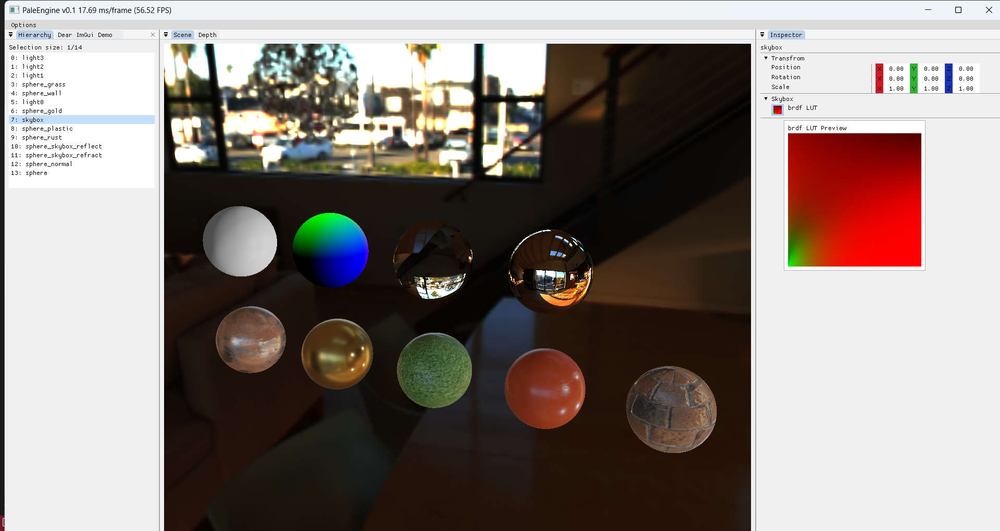

# PaleEngine

## Intro

A toy.

## Setup

Currently only debugged on **Windows11** + **Visual Studio 2022**

Please clone this repo with submodules.
```shell
git clone --recursive git@github.com:0ctonaut/PaleEngine.git
cd PaleEngine
cmake -S . -Bbuild
```

Here are some assets:

+ [LearnOpenGL](https://github.com/JoeyDeVries/LearnOpenGL/tree/master/resources)
+ https://artisaverb.info/PBT.html

## Interface snapshot 250222




## TODO List

+ rendering
  + [X] blinn-phong
  + [X] PBR
    + [X] IBL
      + [X] skybox
  + [ ] OIT
  + [ ] PCF & PCSS
  + [ ] Deferred shading
  + [ ] multi lights

+ GUI
  + [ ] log console
  + [ ] Assets brower
  + [ ] ImGUI gizmo
  + Hierachy
    + [ ] KEY F quick locate
    + [ ] drag, delete
  + Inspector
    + [ ] enable/disable
    + [ ] Right click menu(add/delete component)
    + [ ] quick choose texture window 

+ Profiler
  + [ ] performance
  + [ ] memory leak

+ Optimization
  + [ ] assets reloading cache for textures, meshes...

+ Other
  + [ ] Input event system
  + My own formats to save...
    + [ ] Scene
    + [ ] Material
