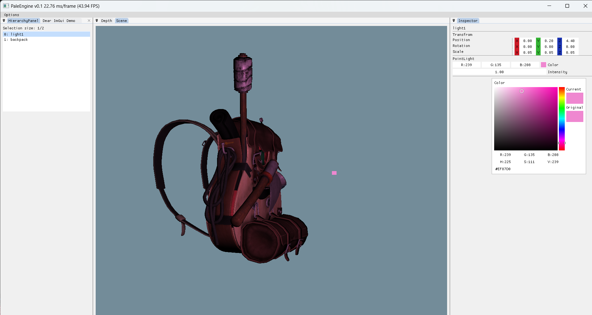

# PaleEngine

## Intro

A toy.

## Setup

Currently only debugged on **Windows11** + **Visual Studio 2022**

Please clone this repo with submodules.
```shell
git clone --recursive git@github.com:0ctonaut/PaleEngine.git
cd PaleEngine
cmake -S . -Bbuild
```

Here are some model files:
+ [backpack](https://learnopengl.com/data/models/backpack.zip)

## Interface snapshot 250213




## TODO List

+ rendering
  + [X] blinn-phong
  + [ ] multi lights
  + [ ] PBR
  + [ ] PCF & PCSS
  + [ ] IBL
  + [ ] OIT
  + [ ] Deferred shading

+ Model loader
  + [x] wavefront
  + [ ] gltf
  + [ ] fbx

+ GUI
  + [ ] log console
  + [ ] Assets brower
  + [ ] ImGUI gizmo

+ Other
  + [ ] Input event system
  + My own formats to save...
    + [ ] Scene
    + [ ] Material
  + [ ] performance & memory leak